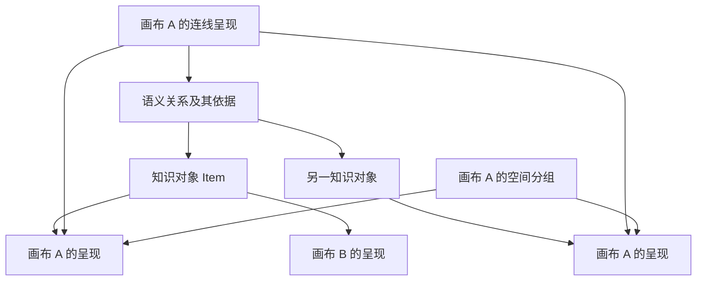
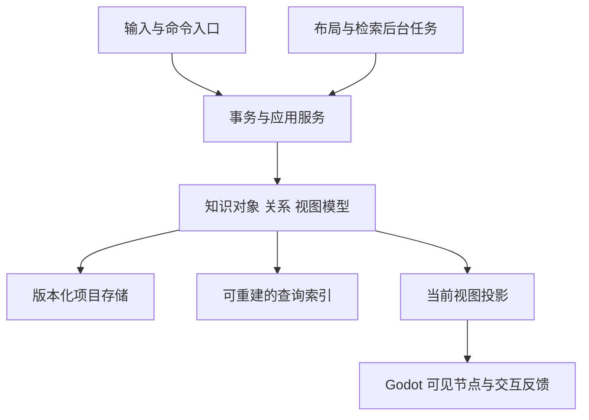

# Project Graph 软件设计调研报告

> 从自由画布走向可复用、可追溯的知识工作台

调研日期：2026-09-29。本文是产品与架构设计建议，不是功能完成清单、性能测试报告或已经批准的实施规格。

## 摘要

Project Graph 最值得探索的方向，是帮助用户围绕一个问题，把零散材料逐步组织成能够解释、核查、复用的知识。快速生长的主题树适合发散，空间排布适合比较与整理，带含义的关系适合表达推理，文档适合连续阅读。软件需要让这些活动使用同一份内容，并在相互转换时保留信息。

这条路线对当前项目有直接意义。项目文档描述的无限画布、文本节点、容器、物理拖动、连线、割线和事务撤销，已经构成空间操作的基础。接下来最关键的设计问题是：画布里的一个对象究竟代表知识本身，还是知识在某个场景中的一次出现？如果这个问题没有明确答案，跨画布引用、语义连线、容器折叠和知识检索都会反复遇到数据歧义。

本文建议采用“稳定知识对象 + 独立视图呈现 + 有上下文的语义关系”的模型。用户可以先自由写画，之后补充含义；系统从创建时就维护稳定身份，不要求用户先理解数据库、本体或图论。物理反馈服务于编辑过程，稳定的空间布局服务于阅读和重访。关系需要保存来源、条件和状态，图算法只帮助查找，不替用户证明结论。

实施上先保证文件可靠与操作一致，再交付边文字、详情、来源和局部检索，随后推进折叠、跨画布复用及多视图。AI 和协作放在身份、引用及事务边界清楚之后。研究证据支持这些方向值得试验，但不足以证明本产品已经提升学习或生产效率。最终应以用户能否更快解释一个问题、找回证据并复用知识来判断。

## 1. 调研范围与证据边界

### 1.1 本文回答的问题

1. 图结构笔记、思维导图与空间白板分别解决什么问题，如何组合才能形成连续的工作流程？
2. 当前 Godot 画布形式的优势在哪里，哪些约束会影响长期知识管理？
3. 如何设计对象、关系、容器、视图和历史，使常见操作具有一致含义？
4. 哪些能力值得优先做，哪些应延后，如何用真实任务判断方向是否成立？

### 1.2 使用的材料

项目材料包括 [AGENTS.md](AGENTS.md)、[TODO.md](TODO.md)、[基础思维导图画布](docs/canvas-mvp.md)和[启动性能调研](docs/startup-performance-research.md)。研究材料包括空间超文本、概念图、图可视化、人机协作与本地优先软件论文，以及相关产品的官方文档。已归档 PDF 见[论文目录](docs/references/papers/README.md)。

本文使用三种表述：**文档记录**表示仓库或产品文档的描述；**研究发现**表示研究在特定条件下得到的结果；**设计建议**表示基于这些材料的推断。三者不能互换。产品文档用于确认交互方法，不能证明某产品效果优于另一产品。

本次是定向调研，不是穷尽检索的系统综述。没有访谈目标用户，没有运行项目测试、构建、基准或 Godot Editor；没有读取或修改 Godot 识别的项目文件。当前环境没有 Godot MCP，代码级复核应在按 [CONTRIBUTING.md](CONTRIBUTING.md)准备工具后另行开展。论文中的样本规模和使用条件不能直接换算为本项目的承载量或收益。

## 2. 产品首先应该承诺什么

### 2.1 一个可以观察的核心任务

建议把首要场景设为：**独立研究者、开发者或需要整理复杂材料的人，围绕一个问题阅读十几份资料，形成有证据的观点，再把其中部分内容用于另一个问题。** 这是待验证的目标用户假设，并非已经完成的市场定位。

这类任务会经历四种状态：材料还没有整理，材料出现初步分组，观点和关系逐渐明确，最后形成可向他人解释的输出。状态之间会反复往返。一个新的反例可能推翻分组，一份新材料可能改变问题，写报告时也可能发现关系根本说不清楚。

因此，软件需要降低的是这些状态之间的转换成本。用户不应为了整理一段材料，在笔记、白板、知识库和报告中反复维护内容副本。

### 2.2 三条可选路线及取舍

| 路线 | 能较快获得的价值 | 长期成本 | 本文建议 |
| --- | --- | --- | --- |
| 强化思维导图编辑器 | 输入快捷、树布局清楚、演示直接 | 多父关系、证据与跨项目复用容易被树结构限制 | 作为入口和视图保留 |
| 强化自由白板 | 操作自由，符合当前物理画布基础 | 内容多时难检索，知识容易停留在单张画布 | 作为探索空间保留 |
| 构建空间知识工作台 | 材料、解释和复用形成连续流程 | 必须处理身份、引用、删除和来源等复杂语义 | 作为发展主线，小步验证 |

第三条路线不意味着立刻开发完整的个人知识管理平台。早期仍应只解决一个完整任务，避免同时承担任务管理、团队文档、演示、数据库和聊天客户端的全部职责。

### 2.3 衡量价值的单位

建议把“一次可解释的知识产出”作为分析单位：用户能说明结论、展示依据、指出尚未解决的分歧，并在后来重新使用其中内容。节点数、边数、画布面积和生成文本量只是活动量，不能直接代表产出质量。

如果用户花在调整位置和修饰线条上的时间持续超过理解材料的时间，应减少整理负担；如果用户只在截图前打开画布，则需要重新评估长期知识复用这条主线。

## 3. 现有方法论应该怎样借鉴

### 3.1 思维导图：把输入变成连续动作

层级展开的价值在于减少输入时的决策：新增子主题、同级主题和折叠分支都有清楚的位置。Xmind 同时提供主题之间的额外关系及关系文字，说明主题层级和跨分支联系可以并存。[Xmind 官方说明](https://xmind.com/user-guide/relationship-new)

对 Project Graph，Tab/Enter 生长值得保留。但一个主题的“父亲”必须由当前主题结构确定，不能把所有指向它的语义边都当作父边。否则增加一条引用关系就可能改变 Enter 的行为。

### 3.2 链接式笔记：让内容在多个上下文中出现

Obsidian 的局部图允许围绕当前笔记逐层展开关系，适合把网络范围控制在当前任务附近。Tana 的引用则强调同一节点在多处出现，内容修改同步反映到引用处。[Obsidian Graph](https://obsidian.md/help/plugins/graph)、[Tana Nodes and references](https://outliner.tana.inc/learn/features/nodes-and-references)

对本项目的启发是，引用应成为普通操作，且在界面上可辨认。用户需要知道“我正在修改一份共享内容”，也需要随时把它另存为独立副本。两种操作不能靠用户猜测快捷键差异。

### 3.3 空间白板：允许尚未说清楚的结构存在

Heptabase 将卡片、分组、思维导图和子白板组合在空间中；Obsidian Canvas 则允许文件卡片与独立文本卡片共存，其纯文本卡片需要转成文件才进入反向链接。[Heptabase 基本元素](https://wiki.heptabase.com/fundamental-elements)、[Obsidian Canvas](https://obsidian.md/help/plugins/canvas)

这暴露出一个设计边界：临时内容何时成为长期知识？本文建议内部身份从创建时就稳定，所谓“收录到知识库”只改变组织状态和可发现范围，不更换对象 ID。用户可以不命名、不分类，也能可靠地撤销、引用与保存。

### 3.4 概念图：关系本身也是内容

Novak 与 Cañas 的方法以焦点问题组织概念，通过连接词形成命题。这里的关键不只是画出网络，而是连接能够读成有意义的陈述。[概念图技术报告](https://cmap.ihmc.us/docs/theory-of-concept-maps)

“布局”和“空间记忆”之间的一条无说明连线很难复用；“稳定布局可能帮助保持空间记忆”则可以讨论、补证据和限定适用范围。因此，边文字应进入正文搜索和知识表达流程，其优先级高于更多线型。

### 3.5 对方法论的限制

用户可能需要草稿中的模糊性，也可能需要报告中的明确性。强迫所有边立刻分类会提高表达门槛；永远只提供无类型连线又会限制后续检索。建议使用渐进规则：空白连线允许存在，自由文字随时补充，常用类型通过建议选用，严格约束只在用户主动选择的任务模板中出现。

## 4. 从论文推导设计，而不夸大研究

### 4.1 空间结构具有表达价值，但不能自动解释用户意图

Marshall 与 Shipman 分析了三个系统中的八个空间布局样例，研究如何从排列识别隐含结构。这是早期探索性证据，不是“距离越近、语义越相似”的普遍定律。[Searching for the Missing Link，§3](https://people.engr.tamu.edu/shipman/viki/papers/ht93/ht93.html)

设计推断：允许聚集、对齐、分隔和笔迹表达尚未明确的想法；自动识别最多生成待确认建议。两张卡片靠近也可能只是为了比较差异，颜色也可能只表示阅读进度。

### 4.2 图形组织的收益取决于具体学习活动

概念图元分析提供了研究基础，但学习方法之间的比较需要看任务。Karpicke 与 Blunt 在科学材料学习实验中发现，检索练习优于其设置下的看材料构图条件；这不等于所有概念图都无效，也不意味着复习功能可以只靠展示关系图完成。[Nesbit、Adesope，2006](https://journals.sagepub.com/doi/abs/10.3102/00346543076003413)、[Karpicke、Blunt，2011](https://learninglab.psych.purdue.edu/downloads/2011/2011_Karpicke_Blunt_Science.pdf)

设计推断：若未来进入学习场景，可以研究遮住部分关系、尝试重建解释、与来源核对等操作；首版无需立即加入完整间隔复习系统。验证要考查延迟理解和迁移，不能只问“看起来是否清楚”。

### 4.3 直接操作、搜索与抽象层级需要协同

InkSeine 将搜索融入笔记现场；Sensecape 探索通过多层抽象组织信息；Graphologue 探索将模型回答转成可继续操作的图；ScholarMate 将文本片段、主题组织与来源追溯结合。这些系统展示了不同交互机会，没有共同证明“一键生成大图”是最佳知识工作方式。[InkSeine](https://cutrell.org/papers/Hinckley-InkSeine-CHI2007.pdf)、[Sensecape](https://arxiv.org/abs/2305.11483)、[Graphologue](https://arxiv.org/abs/2305.11473)、[ScholarMate](https://arxiv.org/abs/2504.14406)

设计推断：搜索结果能够进入当前画布，局部选择能够成为下一次探索的上下文，抽象总结能够返回支撑它的原始内容。这里需要保留人的控制权和可回退路径。

### 4.4 证据强度与可迁移范围

下表根据已归档论文的方法、结果和局限章节整理，页码为 PDF 文件页序，从 1 开始。数值只解释原研究，不作为本项目收益预测。

| 研究 | 实际研究了什么 | 对设计的约束 |
| --- | --- | --- |
| Nesbit、Adesope，2006 | 55 项研究、5818 名参与者；制图子组中，相对写文本或提纲的标准化效应量约 0.194，相对讲授或讨论约 0.742，且分析有样本范围限制 | 主动整理可能贡献较大收益；不能把效应量当作提升百分比。应与认真写作和提纲这类强基线比较。[PDF 第 19–20 页](docs/references/papers/2006-nesbit-adesope-meta-analysis.pdf) |
| InkSeine，2007 | 12 名计算机科学研究生分批参加形成性与迭代可用性研究 | 支持搜索现场整合与手势可发现性的设计探索，不证明长期效率。[PDF 第 3、8–9 页](docs/references/papers/2007-inkseine.pdf) |
| Okoe 等，2017 | 大规模线上参与者的短时图读取实验，使用单一食材共现网络 | 网络实例、任务和交互条件限制外推；不能用其结果断言所有知识图的最佳表示。[PDF 第 7–12 页](docs/references/papers/2017-node-link-matrix-comparison.pdf) |
| Sensecape，2023 | 12 人被试内比较，每条件主要任务 20 分钟，观察概念、层级与重访等行为 | 概念更多、层级更深不等于理解更好；正式基线也集成聊天与画布，应避免把跨应用复制成本误算为层级界面的收益。[PDF 第 8–10、13–14 页](docs/references/papers/2023-sensecape.pdf) |
| Graphologue，2023 | 50 个查询用于技术评价，7 人参加用户研究；标注指标衡量生成文本与图的对应 | 关系标注 F1 不代表事实正确率；用户评价没有同步随机对照。[PDF 第 11–14 页](docs/references/papers/2023-graphologue.pdf) |
| ScholarMate，2025/2026 | 两名研究生的先导试用，另有文献整理案例 | 可提供来源追溯、建议修改和撤销需求的线索；不足以估计一般用户的效率或分类准确率。[PDF 第 5–6 页](docs/references/papers/2025-scholarmate-v3-2026.pdf) |

共同启示是：研究支持更好的表达与控制机制，产品仍需证明收益超过录入、维护和核查成本。论文内部统计口径不清楚的细节不作为本报告的决策依据。

## 5. 对当前软件形式的判断

### 5.1 应保留的基础

项目文档记录了文本与笔迹、创建和割断连线、包含关系、复制粘贴、搜索、保存以及撤销等基础。单父容器、防循环和容器带动内容已经被记录为已有行为，不应作为全新功能重复规划。[TODO：已有基础](TODO.md)

节点树表达可见内容、工具节点与持久对象分离、世界坐标和事务历史，适合作为后续设计约束。本文不建议为了名词一致而重写现有容器，也不改变已确定的 Alt 操作中心锚点。

### 5.2 文档有时间差，不能当作当前代码事实

TODO 的早期条目把部分边属性列为未完善，画布文档则描述颜色、线宽和箭头已纳入其修改范围。两者均有未运行验收的说明。后续实施应先建立功能状态表，分别记录“文档描述、源码确认、运行确认”，不能仅凭一个勾选宣布完成或缺失。

本报告中边文字、知识对象与呈现分离、语义关系、跨画布引用等都作为提案讨论；不据此宣称当前版本完全没有任何类似机制。

### 5.3 物理画布的优势及边界

拖动、避让和容器移动能提供连续反馈，帮助用户理解操作后果。但阅读依赖稳定定位，持续弹动会与它冲突。建议将物理用于交互中的局部反馈，操作后进入稳定状态，固定对象和已经确认的区域不参与无关重排。

“物理稳定”与“布局正确”是不同问题。碰撞可以减少重叠，却不能保证树方向清楚、跨组边少或语义层次合理。需要分别管理碰撞反馈、布局算法和用户手工位置。

## 6. 领域模型：知识、结构和呈现分别负责什么

### 6.1 最小概念集合

以下为建议模型，不要求一开始实现全部实体或立即改变持久化格式。

| 概念 | 身份与职责 | 不应承担的职责 |
| --- | --- | --- |
| 知识对象 Item | 稳定 ID、标题、正文、可选类型、状态、内容修订号 | 不保存某张画布的唯一位置 |
| 来源 Source / 摘录 Excerpt | 文献或文件身份、版本、定位信息、原文片段 | 不自动证明引用者的结论正确 |
| 语义关系 Relation | 稳定 ID、两端知识对象、含义、方向、上下文和依据 | 不承担像素路径与空间包含 |
| 视图 View | 问题、展示范围、组织方式、局部过滤规则 | 不拥有所展示知识的唯一副本 |
| 呈现 Occurrence | 引用 Item，在指定 View 中的位置、尺寸、外观和展开状态 | 不默默覆盖全局正文 |
| 空间分组 Group | 当前视图中的单父包含、边界、组标题与局部摘要 | 不自动生成主题或语义父子关系 |
| 主题结构 Outline | 当前结构中的父子关系和顺序 | 不把任意入边解释为父节点 |
| 连线呈现 EdgeOccurrence | 绑定关系或主题边，以及具体的端点呈现和路径 | 不以隐藏连线代表删除知识关系 |

最小实现可以先保持“一对象一呈现”，但在访问边界上区分对象 ID 和呈现 ID。只有跨视图复用开始实现时，才扩展到多个呈现。现有 `Entity` 指 Godot 舞台对象，新领域对象建议使用 Item 等名字，避免同名概念承担两种身份。

更具体的第一版约束是：同一 Item 在同一 View 中最多出现一次，再次加入时定位已有卡片；在不同 View 中允许分别出现。确有同画布重复引用需求后再放开约束，避免过早承担全部端点选择复杂度。

笔迹、装饰线和临时标记可以继续属于视图注释，不必全部强制转成知识对象。现有 TextNode 容器也可以在适配层保留：容器结构归当前视图，文字若需要复用则引用 Item；复用组标题不自动复制组内成员。领域概念的拆分不等于必须立即拆分全部场景类型。

### 6.2 三种关系必须独立

空间包含回答“放在哪里”，主题层级回答“如何展开这个问题”，语义关系回答“两个内容之间有什么含义”。三者可以在界面上协作，但不应共用一套推断规则。

同一个 Item 可以在不同主题结构中具有不同父主题；每个具体 Outline 内可以约束为树或森林。空间分组同样在具体视图内保持无环单父结构。语义图则允许多父、循环与平行关系。

图论上，可把语义层看作带属性的有向多重图，把空间包含和主题层级看作独立的受约束结构。这个描述用于限定行为，不意味着必须采用专业图数据库，也不意味着所有关系都具有因果方向。

### 6.3 关系要保存条件和作用范围

“方案 A 优于方案 B”通常隐含某个任务、条件和评价标准。若直接成为全局事实，复用时容易失真。Relation 至少需要允许记录：关系文字、可选类型、所属问题或上下文、说明、依据以及“待核查/已检查/有争议”等工作状态。

这里的“已检查”表示用户执行过核查，不是真值保证；系统也不应把未经校准的百分比显示成客观置信度。自由关系文字可以暂时不映射到类型。关系类型有稳定内部 ID，显示名称可改，避免重命名使查询失效。

同一对节点可以同时“引用”和“反驳”，不同上下文也可有不同判断。重复手势的抑制应作用于同一操作意图；业务去重应综合端点、类型与上下文，并允许用户明确保留不同依据的陈述。不能继续仅以“同向两端一致”作为普遍唯一约束。

连线箭头的显示与关系方向同样需要区分。隐藏箭头只改变外观，不把“引用”变成无向关系；反转一条有语义的关系会改变命题，应作为内容修改进入历史。“支持”和“被支持”可以是同一关系的两种阅读方式，不必自动新建两条事实记录。

### 6.4 一份证据可以支持对象，也可以支持关系

有时材料支持“这个概念的定义”，有时支持“A 会影响 B”这一判断。因此，来源引用不能只挂在节点正文末尾。应允许 Relation 拥有证据引用；复杂论证再显式提升为“主张”Item，连接支持和反驳材料。

首版不必实现任意超边或通用逻辑推理系统。二元关系、关系证据与可选主张节点已经能够表达多数初期任务。多目标视觉连线也不能自动等同于多元语义关系，应另行定义其参与者角色。

### 6.5 稳定身份与可读文件可以并存

标题、文件路径和正文哈希都不适合独立承担可编辑对象身份：标题会改，路径会移动，相同文本也可能表达不同上下文。复用现有稳定 ID 能力并在领域层保持它，比创建另一套 ID 更稳妥。

内容哈希适合附件去重和版本识别，不应决定两条笔记是否同一对象。重命名仅改变显示属性；导入时为外部身份建立明确映射，跨项目复制则记录新的身份和可选来源关系。

### 6.6 视图成员与筛选结果也要区分

手工画布保存用户明确放入的呈现；筛选仅暂时隐藏不匹配内容。查询视图则根据规则产生结果，移除某个结果不能模糊地等同于修改原知识。建议初期让查询结果通过“加入画布”转为明确成员，动态视图在后续单独设计排除规则。

位置、折叠和临时筛选不是知识的真假状态。用户把反例藏起来，不代表反例已被解决；输出报告时应允许检查被过滤的关系类型及内容范围。

## 7. 把操作语义定义清楚

### 7.1 画布操作与知识操作的范围

| 操作 | 建议作用范围 | 必须可观察的结果 |
| --- | --- | --- |
| 移动卡片、调整颜色与宽度 | 当前呈现 | 其他画布的布局保持原样 |
| 编辑共享正文 | 知识对象 | 所有呈现同步；编辑入口提示共享身份 |
| 移入容器 | 当前视图的空间包含 | 不改变语义关系或其他主题结构 |
| 解组 | 移除空间分组约束，保留子呈现 | 子卡片与知识对象仍在原处，组标签按明确规则保留或移除 |
| 隐藏一条连线 | 当前连线呈现 | 关系仍可通过关系面板查到 |
| 删除语义关系 | 指定 Relation | 所有关联呈现一致更新，并可撤销 |
| 从画布移除卡片 | 当前呈现及其显示连接 | 知识对象可从对象库找回 |
| 删除知识对象 | 项目范围的显式操作 | 列出受影响引用，进入可恢复状态 |
| 粘贴引用 | 新呈现，原 Item | 后续编辑正文共享 |
| 粘贴独立副本 | 新 Item 和新呈现 | 后续编辑正文互不影响 |

这张表描述目标语义，不应在旧版文件中悄然改变 Delete 或割线的既有含义。需要显式命令、清楚文案和迁移策略。未引入共享对象前，继续维持当前用户已掌握的行为；引入时提供“从画布移除”和“删除内容”的可辨识入口。

割线尤其需要设计：它目前直观表达切断连接，而共享关系可能被其他视图使用。建议让“整理当前视图”和“编辑关系”在工具入口和反馈上可区分，预览显示本次影响范围，不依赖隐藏模式，也不为每条边重复弹确认框。

### 7.2 同一个对象有多个呈现时，连线必须指定端点

如果同一 Item 在一张画布上出现两次，只保存关系两端的 Item ID 不足以确定画线位置。EdgeOccurrence 应明确指向两端 Occurrence ID。系统可以建议为现有语义关系建立一条呈现，但不能把所有呈现两两相连形成乘积。

单击选中的是当前呈现，正文编辑作用于对应 Item；“选择所有引用”是另一个显式命令。若关系另一端不在画布里，可用局部入口显示“另有若干关系”，由用户展开，避免自动拉入整个知识库。

### 7.3 折叠是展示规则，不能改变端点身份

容器折叠时可以隐藏内部呈现，把穿越边界的线映射到边界入口，并显示数量和类型。这个聚合入口属于临时或派生展示，真实关系端点仍是内部知识对象，展开后恢复。

不同含义的边不应无条件合为一条。聚合线需要能够展开查看成员，避免把支持与反驳压成同一种关系。折叠组的摘要属于当前解释；若要跨项目复用，应由用户明确提炼为独立知识对象。

隐藏的子呈现应暂停对可见画布的碰撞和物理影响，保存折叠前的局部布局。展开时先恢复确定位置，再处理确实存在的有限碰撞；不可见卡片不应继续推动外部对象，展开也不应触发整组随机重新排布。

### 7.4 复制与导出都需要依赖范围规则

选中一个容器时，复制和导出通常需要包含其后代和内部连接；外部连接则应作为可选附带引用或明确缺失端点。复制独立副本时，对象集合先去重，再一次性生成 ID 映射，以保持内部引用一致。

可以共享“选择范围展开”的服务，但不同输出允许不同策略：图片需要可见内容快照，结构导出需要身份与依赖。不要让每种导出单独解释容器后代。源文件中未知对象仍需原样保留或以明确受限模式处理，不能因本版本不认识便在重存时丢弃。

### 7.5 撤销与持久版本各自解决不同问题

一次拖动，包括被容器带动和物理避让影响的对象，应记录操作前与稳定后的状态，而不是把每个物理帧写入历史。达到停止条件或超时上限后收敛为确定状态，取消操作则恢复起点。不能让未结束的物理过程与下一次操作混成一个事务。

共享正文在多个视图可编辑时，推荐先采用项目级顺序事务历史，撤销菜单显示动作及涉及视图。视图间交错修改不应被两个互不知情的局部栈覆盖。未来协作撤销需要按操作和作者重新设计，不能等同于恢复旧快照。

撤销解决短期操作错误，版本历史解决较长时间的恢复和审计。首版可继续采用快照或明确命令记录，不必为了未来协作先实现完整事件溯源系统。

## 8. 交互设计：降低每一次结构决策的负担

### 8.1 创建时保持轻，整理时提供深度

双击或快捷键创建后直接输入文字，默认类型为普通笔记。来源、关系类型和模板保持可选。用一个展开的详情区域承载正文、出处与关联，避免一张画布充满必须逐一填写的字段。

“一条笔记只写一个概念”可以是整理建议，不应是硬约束。长内容可以先存在，之后通过拆分操作形成多个对象，同时保留来源和被引用位置。合并时需显式决定旧 ID 的别名或重定向，避免已有引用断开。

### 8.2 提供清楚的工作上下文

建议视图顶部保留当前问题和位置路径，侧边提供对象搜索与关系列表，画布保持主要操作空间。详情面板可以在需要时展开。所谓探索、整理、阅读三种活动可通过可见性预设切换，不必变成三个互不兼容的编辑器。

导航需要返回历史、当前位置标记和定位到来源的入口。搜索命中后应解释为什么命中，并保留原视野的返回路径；如果自动展开容器，退出定位时应能恢复之前状态。

### 8.3 键盘与中文输入必须先于更多手势

Tab/Enter、F2、Esc 等动作要随焦点决定含义。中文输入法候选确认不能触发创建主题，正文中的换行不能触发画布操作。所有重要手势都应有菜单或键盘入口，避免仅靠右键拖动、摇晃或 Alt 组合才能使用。

关系与状态不能只用颜色编码。文字、大纲或关系列表需要提供空间布局之外的访问路径；减少动态效果和固定布局应作为可选偏好。这里属于设计要求，Godot 控件在目标平台的输入法、可访问性和焦点表现仍需实际验证。

### 8.4 缩放要改变信息密度，但避免内容跳动

远处显示组名和摘要，中距显示卡片标题及关键关系，近处显示详细内容。缩放阈值需要滞回，避免轻微滚轮输入导致反复切换。布局边界尽量不随细节显隐大幅变化，固定阅读器中的正文也不随画布缩放变得过小。

摘要应优先使用用户整理的内容。自动摘要可以是建议或缓存，必须能回到原始材料，且原文变化后标记待更新。

### 8.5 一个具体工作过程

以“这个编辑器是否应该默认自动布局”为例，以下是设计场景，不是实验结果。

用户先放入三类材料：图布局研究、自己使用旧版本的观察、目标用户的反馈。三类内容可以混排，但每张卡片的来源性质可查。用户先把“找不到原来位置”和“新节点重叠”放到一起，暂时不必决定它们属于缺陷、需求还是概念。

整理后，用户写出“默认只重排新增区域”的候选主张，将相应观察标为支持材料，将“初次导入需要整体布局”标为限制条件。边上可以写完整自然语言，必要时再归入支持、限制等类型。

然后用户建立“首次导入体验”第二张画布，引用同一条候选主张，但采用另一套位置和主题层级。补充主张正文后，两张画布同步；第一张图里用于比较的分组不需要复制过去。

输出决策说明时，用户按“问题—候选方案—依据—反例—下一步试验”组织阅读顺序。几天后打开报告，仍能返回当时的摘录和画布。这个过程检验的是同一内容在不同理解阶段是否保持身份和出处，而不只是能否画出更多形状。

## 9. 图算法如何进入产品

算法应对应具体问题，而不是为了展示图论能力加入菜单。

| 用户问题 | 计算或索引 | 交互边界 |
| --- | --- | --- |
| 谁支持这个观点？ | 按类型查询入边及证据 | 明确支持关系由谁记录，不能把引用都算支持 |
| 修改这个决定会影响什么？ | 有方向、有类型限制的遍历 | 显示遍历规则、深度和截断数量 |
| 两个主题如何相关？ | 限定上下文的路径搜索 | 路径是导航结果，不是推理证明 |
| 依赖结构是否存在循环？ | 指定依赖子图的环检测 | 语义图中的循环本身不一定是错误 |
| 哪些材料尚未整理？ | 状态与指定关系缺失查询 | 孤立对象也可能是有价值的草稿 |
| 哪些内容值得放在一起？ | 标签、文本相似度或聚类候选 | 由用户确认，不自动重排或写入事实 |

初期使用按 ID 索引及入边、出边邻接索引即可支持基本查询。邻接索引和全文索引都属于可重建数据，持久关系记录才是事实来源。复杂算法优先复用社区库，避免在产品代码中建立一套自制通用图算法框架。

默认只展开有限邻域，对高连接节点分页或按类型分组；给出“还有多少未显示”的提示。布局是候选位置计算，与领域关系修改分开：预览、接受、取消分别有明确状态，接受时才产生布局事务。

全局图可作为概览，但不能成为唯一导航。关系表、大纲和证据列表分别适合查找、阅读和比较。节点连线图与矩阵研究说明表示选择依赖任务，不能直接用某篇论文的节点规模阈值决定本项目界面。[Okoe 等，2017](https://arxiv.org/abs/1709.00293)

## 10. 来源与知识生命周期

### 10.1 从材料到观点，保留原文与解释的区别

Source 保存文献或附件身份、标题、URL、获取时间和版本信息；Excerpt 保存原文摘录及位置；笔记正文保存用户解释。三者可以相互链接，但用户改写理解时不能无意覆盖原始摘录。

PDF 定位可组合页码、文字片段和几何范围；网页可组合原文、前后文和地址。单一定位方式可能因源文件更新失效，所以应保存来源版本及可读摘录。定位失败时展示旧摘录并提示重新关联，不能悄悄跳到相似段落。

### 10.2 内容更新不应悄悄改变历史论据

普通笔记引用可默认跟随最新内容；论文摘录、已发布报告和需要审计的结论应允许固定到特定修订。正文发生变化后，相关关系可标记“依据已变化，需要复核”，但系统不能自动宣称原结论无效。

建议先实现可见的来源变更提示，不立即建立全量推理依赖系统。内容修订号与视图布局修订号分别递增，避免移动卡片触发证据过期提示。

### 10.3 输出应成为可返回的阅读路径

画布默认没有唯一阅读顺序。生成报告时，应允许用户选择章节顺序、主张、证据及未解决问题，生成带来源链接的文档快照。若将来支持同步编辑，需要另行定义冲突规则；首版输出不承诺任意 Markdown 编辑后无损回写。

一次输出记录使用的对象和内容版本，让用户能从报告返回形成它的画布。这样，输出过程也会暴露没有依据的观点和解释不清楚的关系。

## 11. 存储、架构与性能策略

### 11.1 项目包与对象库的演进

建议短期保持项目包作为用户可理解的交付单位，每个项目内部管理知识对象与多张视图。先实现项目内跨画布引用，再讨论跨文件共享库。这能避免首版同时承担路径迁移、全局身份、权限和分布式一致性。

打开旧格式时先识别版本，在临时模型中迁移，生成损失与不支持类型说明，保留原文件。稳定 ID、正文、容器关系和附件都应有往返保存要求。无法保留未知数据时应限制覆盖，而不是加载成功后静默丢弃。

保存采用可恢复的替换过程，自动保存与备份分别定义：前者缩短丢失窗口，后者保留旧状态。替换、刷新和掉电行为要针对目标操作系统验证，不能把一次重命名视为跨平台耐久性保证。搜索索引和布局缓存损坏应允许重建，不影响原始知识读取。

### 11.2 领域模型与 Godot 节点各自承担什么

领域模型负责内容与不变量，命令服务统一处理创建、删除、粘贴、导入和 AI 提案，视图投影负责映射可见内容。可见卡片、线条、预览和碰撞仍由 Godot 节点表达，遵守现有节点树规则。未展示的知识可以保存在数据层，无需为整个知识库永久创建物理实体。

逐步演进时先给现有入口增加模型访问接口，再抽离共享内容，最后扩展多呈现。避免一边用旧场景属性、一边用新领域对象分别充当正文的权威来源。

### 11.3 性能要区分数据规模、可见规模与活动规模

知识库有一万条内容、当前显示一百张卡片、正在拖动十个对象，是三个不同负载。后台检索、可见节点和物理求解分别按这三个范围工作。首要措施是减少无关工作，再考虑更复杂的图形优化。

布局、附件处理和全文索引可以消费不可变快照，在后台返回结果；结果附带输入修订号，主线程只接受仍适用的结果。取消操作或关闭视图后，任务必须能释放资源，不能把过期结果写回新状态。不要在工作线程直接修改活动场景树。

Godot 提供线程池，但线程调度也有成本，活动场景树并非线程安全；因此只有测得足够重的纯数据工作才应移到后台。[WorkerThreadPool](https://docs.godotengine.org/en/stable/classes/class_workerthreadpool.html)、[Thread-safe APIs](https://docs.godotengine.org/en/stable/tutorials/performance/thread_safe_apis.html)

可见对象裁剪必须保留当前编辑、选中、拖动及边界连接所需状态。暂停远处物理反馈前，要把确定位置保存到模型；重新进入视野不应造成知识对象跳位。节点树优先与按需实例化并不冲突。

性能目标应在目标设备上制定。首次可编辑时间、输入到反馈延迟、拖动帧时间、检索延迟和后台保存阻塞分别记录；使用百分位和最坏卡顿，避免只看平均帧率。当前没有测量结果，不承诺任何节点上限。[既有启动性能调研](docs/startup-performance-research.md)

### 11.4 标准能力与社区库：复用候选及暂不采用的理由

下表是官方资料核查后的候选清单，未引入任何新依赖。现有 Godot 版本、编译器、导出平台和插件 ABI 尚未通过代码与环境复核；`stable` 文档不代表所有 API 都适用于当前工程。

| 问题 | 优先评估的现成能力 | 集成责任和选择条件 |
| --- | --- | --- |
| ID 查找与邻接索引 | Godot [Dictionary](https://docs.godotengine.org/en/stable/classes/class_dictionary.html)、Array | 复用容器，不自写哈希表；项目负责关系不变量、索引重建和快照隔离 |
| 简单项目序列化 | Godot [JSON](https://docs.godotengine.org/en/stable/classes/class_json.html)、[FileAccess](https://docs.godotengine.org/en/stable/classes/class_fileaccess.html) | 复用读写与解析；项目负责模式、迁移、引用完整性和故障恢复，ID 用稳定字符串避免数值语义差异 |
| 本地事务与全文检索 | [SQLite](https://www.sqlite.org/whentouse.html)、[FTS5](https://www.sqlite.org/fts5.html)，候选绑定 [godot-sqlite](https://github.com/2shady4u/godot-sqlite) | 需要频繁局部更新或更强索引时评估；绑定自身声明支持不等于本项目已兼容，FTS5 构建选项与平台二进制必须核实 |
| 分层布局与端口 | [ELK](https://eclipse.dev/elk/gettingstarted.html)、[elkjs](https://github.com/kieler/elkjs) | Java/JavaScript 运行时需要适配，不是直接可用的 GDScript 依赖；只有布局收益足以承担分发成本时采用 |
| 多种图布局 | [Graphviz 布局](https://graphviz.org/docs/layouts/)、[库接口](https://graphviz.org/docs/library/)与[JSON 输出](https://graphviz.org/docs/outputs/json/) | 可评估桌面原生库或进程方式；只取坐标和路径，由 Godot 节点呈现；需处理单位、字体尺寸和坐标系 |
| 画布交换 | [JSON Canvas 1.0](https://jsoncanvas.org/spec/1.0/) | 使用引擎 JSON 解析后映射字段；可表达卡片、分组与边，无法默认无损表达全部证据、历史及多呈现语义 |
| 将来的同步 | [Automerge](https://github.com/automerge/automerge)、[Yjs](https://github.com/yjs/yjs) | 存在成熟 CRDT 候选，不自研合并算法；Godot 运行时适配、传输、并发删除与撤销语义仍需定义，当前暂缓 |

Godot 采用 MIT，SQLite 核心为公有领域，所列 godot-sqlite、Automerge 和 Yjs 仓库采用 MIT；当前 ELK/elkjs 与 Graphviz 官方资料标注 EPL-2.0。选型时必须核对具体版本及传递组件的许可，不能仅依项目首页名称推断发布义务。[Godot 许可](https://docs.godotengine.org/en/stable/about/complying_with_licenses.html)、[SQLite 版权](https://www.sqlite.org/copyright.html)、[ELK 项目](https://projects.eclipse.org/projects/modeling.elk)、[elkjs 许可](https://github.com/kieler/elkjs/blob/master/LICENSE.md)、[Graphviz 许可](https://graphviz.org/license/)

布局适配器只承担选区、尺寸、固定约束和格式转换。候选是否真正支持保持已有位置，应通过目标版本实例评价，不能把“支持自动布局”写成“已解决稳定布局”。进程式集成还需要取消、超时、退出清理；桌面方案不能自然推广到移动和 Web。

若采用 SQLite，有两种清楚的边界：仅作可重建搜索缓存，或成为项目数据的唯一事实来源。不要同时把 JSON 和数据库设为可独立写入的权威副本。引入事务库可以减少通用存储工作，但外部附件与数据库的一致性、备份恢复仍是应用职责。[SQLite 原子提交](https://www.sqlite.org/atomiccommit.html)

真正引入依赖时，建立精确版本或提交、工件 SHA-256、下载地址、许可证及传递依赖、引擎与 ABI、编译器和构建工具链、目标 OS/CPU、运行时和 I/O 模型、最小接入验证及回退方式的记录。本轮没有安装依赖，因此不虚构已固定版本、哈希或兼容性结果。

### 11.5 中文搜索是独立的产品问题

候选 godot-sqlite 的官方说明指出，FTS5 默认未启用，需要以对应选项重新编译。SQLite FTS5 的 trigram 全文查询对不足三个 Unicode 字符的子串不能直接匹配。由此不能推断安装绑定后就已经具备合格的中文检索。[绑定说明](https://github.com/2shady4u/godot-sqlite)、[FTS5 trigram 文档](https://www.sqlite.org/fts5.html#the_trigram_tokenizer)

应准备包含“布局”“引用”等两字词、连续中文、英文标识符、大小写、标点、标题、关系文字和长摘录的语料。分别观察召回、排序、高亮和定位，先保留可靠的基础匹配作为回退，再评估现成分词器或检索库。标题同名也不能自动合并知识对象。

首要搜索范围建议为当前视图、当前项目与指定来源，结果说明匹配字段和所在上下文。向量相似度可以作为后续补充，但不应替代用户输入精确词语时预期的查找行为。

## 12. AI 与协作的进入条件

### 12.1 AI 以可检查的修改提案参与

合适的首批任务是为选中材料建议分组、提炼带来源的摘要、列出分歧以及建议关系。每项提案包含作用范围、引用材料、预计修改和内容基线。用户能够接受一部分、修改后接受或全部取消，接受后进入普通事务历史。

AI 生成关系与用户确认关系应可区分，模型输出不能自行升级为证据。用户确认一条建议也不表示其内容得到外部验证。源材料中的文字作为内容处理，不应成为控制应用的指令。

网络请求默认限定为用户选定材料，提前展示范围；超时、取消和部分结果有明确状态。后续实施应做本地端到端验证，覆盖断开、重试和资源清理，遵守仓库要求。此次不实现网络功能。

### 12.2 协作复杂度来自业务语义

多人同时修改标题相对容易描述，多人把同一卡片移入不同容器、删除对方引用的知识或撤销一次共享布局更难。即使底层 CRDT 收敛，也不自动满足单父、无环和用户意图。

因此，先稳定单用户的操作语义和持久格式，再评估成熟同步库。共享正文、共享视图、个人视图、临时光标与物理动画应分别同步或保持本地。物理过程不应逐帧广播成持久编辑；提交的是确定的操作结果。[Local-first Software](https://www.inkandswitch.com/essay/local-first/)

本地优先可以先通过可靠离线读写、可迁移格式和清楚备份实现。实时协作不是这些能力的前提。

## 13. 实施路线与决策门槛

### 13.1 先做一个完整任务

建议下一阶段用“十几份材料形成一份有出处的观点图”作为交付切片：收集文本与链接、节点详情、边文字、来源跳转、搜索、保存恢复和一次完整导出。身份边界在这一阶段设计，但不要求完整对象库和 AI 同时上线。

| 阶段 | 核心工作 | 进入下一阶段的依据 |
| --- | --- | --- |
| A：建立可信基线 | 复核现状；文件兼容与未知数据保护；保存、复制、撤销一致性 | 真实材料可保存、重开、撤销且无静默损失 |
| B：表达与核查 | 详情、边文字、来源摘录、关系列表和搜索 | 用户能解释结论，并返回对应证据 |
| C：稳定阅读 | 折叠摘要、锁定、局部图、局部布局、导航返回 | 重访复杂画布的时间与误操作有所改善 |
| D：知识复用 | 对象与呈现分离落地；项目内多视图；复制/引用/删除明确 | 同一内容跨画布复用时不产生副本维护负担 |
| E：辅助与扩展 | 有来源的 AI 提案、需要时再做协作与插件边界 | 基础流程已被持续使用，且确有对应成本 |

这些阶段由依赖和验证结果决定，不是工期承诺。每个独立功能或修复保持原子提交；实现时按授权执行必要检查，当前报告不触发测试或 Editor。

### 13.2 明确延后的能力

- 任意本体编辑器、通用推理引擎和全功能图数据库界面：先证明普通关系与证据足够或不足。
- 默认全局自动重排：先保障局部操作与空间稳定。
- 任意超图、多端关系编辑：等实际任务需要参与者角色后再设计。
- 跨文件实时共享与多人物理编辑：先明确单项目引用和事务。
- 完整富文本办公套件、任意格式双向无损同步：先保留正文、来源和结构的可靠输出。
- 自动生成整个知识库：先实现选择范围内的建议及证据检查。

### 13.3 需要保留的反对意见

对象与呈现分离增加实现成本，如果用户主要制作一次性图表，其收益可能不足。可先以一个对象对应一个呈现的内部边界试验，再通过多画布任务决定是否扩展。

语义边也会增加维护成本。如果用户频繁写“相关”并且从不按关系查询，应先改善关系建议和阅读方式，不应继续加类型字段。来源记录若明显打断输入，可以先自动保存 URL 或拖入附件的基础元数据，整理时再补具体定位。

物理交互若使输入和阅读更慢，应允许关闭或限制范围。Godot 是否适合大规模富文本和可访问性，需以真实目标平台验证；在缺少证据时，不把重写技术栈列为默认解决方案。

## 14. 如何证明方向有用

### 14.1 可被否定的设计假设

| 假设 | 观察任务 | 反证或停止条件 |
| --- | --- | --- |
| 带语义的边帮助理解 | 隔几天解释一张旧图，找到支持和反驳材料 | 输入成本增加，解释准确度与证据查找均无改善 |
| 多呈现减少重复维护 | 同一条内容用于两个问题，之后修改正文 | 用户分不清共享与副本，误改与修复成本增加 |
| 局部布局优于全局重排 | 新增材料后继续寻找原有观点 | 局部方案的残留遮挡和手动整理成本更高，全局重排后的定位同样快或更快 |
| 折叠摘要帮助管理复杂度 | 从概览找到支持某结论的具体摘录 | 摘要造成过度概括，用户无法回到原文 |
| AI 提案减少整理工作 | 对难度相近的配对材料完成分组及证据核查 | 节省整理时间小于检查、纠错和恢复时间 |

### 14.2 建议的研究方式

先用少量目标用户做形成性观察，关注误解和中断，不宣称统计普遍性。随后用难度相近、内容不同的配对材料比较当前工作流与候选设计，平衡界面与任务顺序，并提供练习时间、记录熟悉程度。重复使用同一批材料会产生记忆迁移，不能只靠交替顺序消除；若为观察操作而使用同材料，应明确不据此估计因果收益。

再让用户带着自己的资料使用一段时间，观察重访与跨项目复用。短时实验难以发现“几周后找不到上下文”或“引用累积后不敢删除”的问题。样本量、周期和统计方法应由具体假设与可用资源另行确定。

指标包括任务完成率、错误率、证据定位时间、旧图解释准确度、重复录入量、修复时间和主观负担。布局操作占比只作为诊断信号；用户有时通过排列思考，不能把所有拖动都视为浪费。

### 14.3 由用户执行的手动验收

以下均为未来验证方案，尚未执行；提案功能须实现后再验收。

| 如何触发 | 应观察到的结果 | 失败时重点检查 |
| --- | --- | --- |
| 创建问题画布，快速输入并使用中文输入法确认候选 | 一次输入只产生预期内容与对象 | 焦点、输入法状态、快捷键是否抢占 |
| 对一对对象分别创建引用和反驳关系，再搜索边文字 | 两种关系独立存在且可准确命中 | 去重范围、关系类型、索引更新 |
| 同一对象放入两张画布，修改正文并分别移动 | 正文共享、位置独立 | 是否误创建副本或共用布局字段 |
| 折叠含跨组连线的容器，再展开 | 聚合提示可追溯，真实端点恢复 | 折叠是否改写关系或漏掉内部连接 |
| 从画布移除一个呈现，再从对象库找回 | 原知识与其他引用仍存在 | 删除范围及回收站状态 |
| 拖动容器并等待稳定，随后撤销一次 | 全部受影响对象恢复到操作前状态 | 是否漏记物理连带位移或拆成多个事务 |
| 保存重开含未知对象、缺失附件的测试副本 | 明确报告问题并保护原数据 | 未知字段保留、引用恢复、覆盖策略 |
| 从结论跳到摘录，更新源文件后再次定位 | 固定摘录仍可读，变化或失效被说明 | 来源版本、定位锚点、静默错配 |
| 复制容器与导出选区 | 后代及内部关系完整，外部依赖处理明确 | 选区展开、ID 映射、导出快照 |
| 在大型样本中持续输入、拖动并取消后台布局 | 前台可操作，取消后不写回过期结果 | 主线程阻塞、任务修订号、资源清理 |

不能用一次冒烟检查代替长期使用评价。保存与撤销的完整性属于交付门槛；理解和复用收益属于需要反复验证的产品假设。

## 15. 建议形成的设计决定

1. 以“围绕问题形成有依据的解释”作为首要任务，并验证目标用户是否认可。
2. 继续发展现有画布与节点树交互，物理过程局部化、可停止、可撤销。
3. 提前分清知识对象与呈现身份，跨画布功能按阶段实现。
4. 空间包含、主题层级与语义关系独立建模，避免输入行为随普通连线变化。
5. 把关系文字、来源与局部检索放在更多图形样式之前。
6. 默认允许不完整和模糊表达，通过渐进操作建立结构。
7. 先让保存、恢复、复制和删除可靠，再扩大对象类型与自动化范围。
8. AI 输出作为可核查提案，协作在业务语义清楚之后选用成熟基础设施。
9. 按真实任务评估收益，并保留缩减功能或调整路线的条件。

这组决定的价值在于约束后续功能：每增加一个能力，都能说明它帮助哪个任务、修改哪一层数据、如何撤销、如何返回来源，以及在什么情况下应该停止投入。

## 附录 A：参考资料入口

既有调研索引见 [docs/references/README.md](docs/references/README.md)，原始 PDF、版本与下载来源见 [docs/references/papers/README.md](docs/references/papers/README.md)。本文在相关论述旁保留直接来源链接。

| 资料 | 本地原文或入口 | 在本文中的用途 |
| --- | --- | --- |
| Searching for the Missing Link，1993 | [作者 HTML 全文](https://people.engr.tamu.edu/shipman/viki/papers/ht93/ht93.html) | 空间隐含结构与渐进明确化 |
| VIKI，1994 | [作者论文索引](https://people.engr.tamu.edu/shipman/viki/papers/vkat-papers.html) | 后续阅读线索；未据摘要编写实验结论 |
| Nesbit、Adesope，2006 | [PDF](docs/references/papers/2006-nesbit-adesope-meta-analysis.pdf) | 概念图学习证据及其范围 |
| InkSeine，2007 | [PDF](docs/references/papers/2007-inkseine.pdf) | 笔记现场的搜索和收集 |
| Novak、Cañas，2008 | [PDF](docs/references/papers/2008-novak-canas-concept-maps.pdf) | 焦点问题与命题 |
| Karpicke、Blunt，2011 | [作者实验室 PDF](https://learninglab.psych.purdue.edu/downloads/2011/2011_Karpicke_Blunt_Science.pdf) | 学习方法比较的反例与边界；未在本地归档 |
| Okoe 等，2017 | [PDF](docs/references/papers/2017-node-link-matrix-comparison.pdf) | 图表示依赖任务 |
| Local-first Software，2019 | [PDF](docs/references/papers/2019-local-first.pdf) | 数据持有、离线与协作边界 |
| Sensecape，2023 | [PDF](docs/references/papers/2023-sensecape.pdf) | 多层抽象 |
| Graphologue，2023 | [PDF](docs/references/papers/2023-graphologue.pdf) | 图形式的 AI 交互 |
| ScholarMate，2025/2026 | [PDF](docs/references/papers/2025-scholarmate-v3-2026.pdf) | 材料整理、主题建议与证据追溯 |

## 附录 B：本次交付与未执行事项

实际改动：新增根目录本报告，未修改项目功能、持久化格式或第三方目录。使用工程调研技能，通过本地普通文档与论文读取、公开网页检索形成结论；未调用 Godot MCP 工具。

未执行：项目测试、构建、格式检查、Godot Editor、目标平台兼容性验证、性能测量、用户访谈和上文手动验收。实施提案时仍需遵守仓库授权及原子提交要求。
